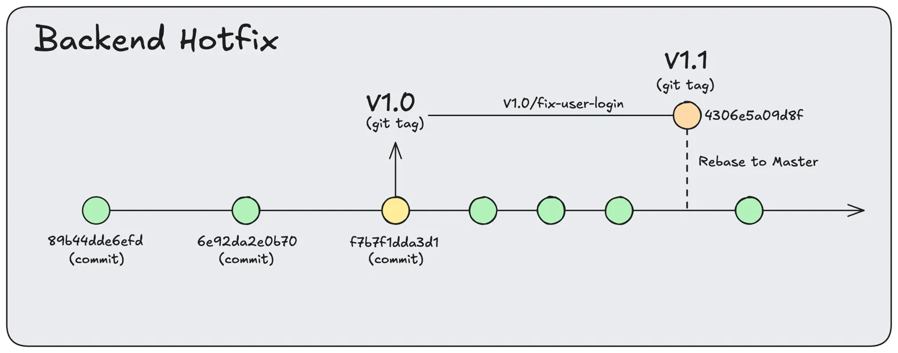

# Backend Hotfixes

Backend hotfixes are straightforward.
You can create a new tag based on the current version of the backend.



### Create backend hotfix branch

```
git checkout -b hotfix/fix-user-login v1.0.0
```

### Commit fixes to backend repo

```bash
git add .
git commit -m "hotfix: fix null pointer in login component"
```

### Tag hotfix

```bash
git tag -a v1.1 -m "Hotfix v1.1: Backend login component fix"
```

### Push hotfix tag

```bash
git push origin main --tags
```

### Ready to deploy

Now we can check out the tag in the server

### Cleanup
With the fix deployed, now we can move our fixes back to the main branches

```bash
git checkout main
git rebase hotfix/fix-user-login
git branch -d hotfix/fix-user-login
git push origin main --tags
```
