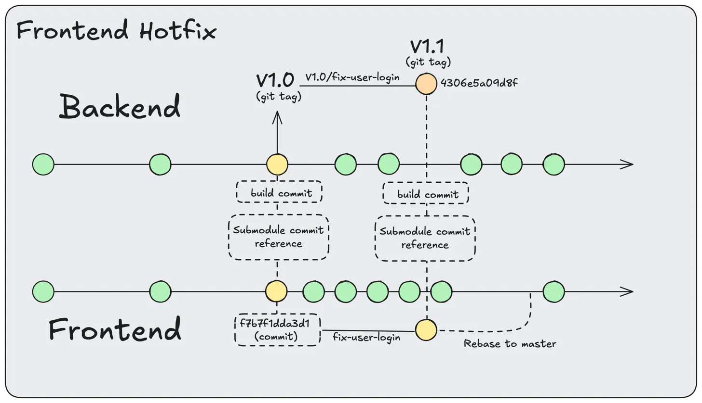

# Frontend hotfixes

Hotfixing frontend requires the creation of a new branch,
forked out of the commit referenced in the latest tag.



### Lookup the commit tracked in the submodule for the latest tag

```bash
git show v1.0.0:frontend 
```

### Create frontend hotfix branch

In the frontend repo, create a new branch from this commit

```bash
git checkout -b hotfix/fix-user-login $FRONTEND_COMMIT
```

### Commit fixes to frontend repo
```bash
git add .
git commit -m "hotfix: fix null pointer in login component"
```

### Update backend with frontend changes

```bash
# Update submodule repo
git submodule update --remote frontend
# Point to your hotfix branch
git submodule set-branch -b hotfix/fix-user-login frontend 
# Update the build
./build.sh
```

### Commit fixes to backend repo

```bash
# Create a new hotfix branch in the backend repo from the deployed tag
git checkout -b hotfix/fix-user-login v1.0.0
# Add the updated frontend files
git add frontend/ public/
# Commit the changes
git commit -m "Hotfix v1.1: Frontend login component fix"
```

### Tag hotfix

```bash
git tag -a v1.1 -m "Hotfix v1.1: Frontend login component fix"
```

### Ready to deploy

Now we can check out the tag in the server

### Cleanup

With the fix deployed, now we can move our fixes back to the main branch

#### 
```bash
# Checkout main branch
git checkout main
# Rebase the hotfix branch onto main
git rebase hotfix/fix-user-login
# Delete the hotfix branch
git branch -d hotfix/fix-user-login
# Push the changes to main and tags
git push origin main --tags
```

For the backend, if no changes were made, you can skip the rebase step.
Otherwise, you can rebase the backend hotfix branch onto main as well.

> **Note** Rebasing the backend will override the frontend submodule commit AND the build.
> 
> Make sure to keep the build and submodule commit up to date.

