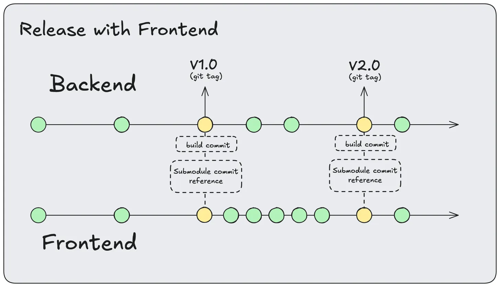
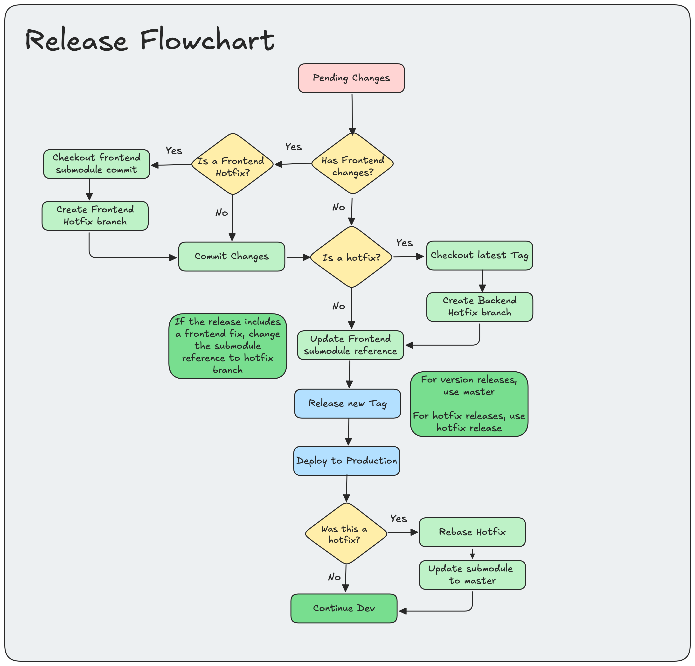

# Release Guide

A simple guide for releasing updates using tags

#### Git structure



#### Simplified Flowchart



## Frontend changes

Releasing a new version with frontend changes requires updating the submodule reference, 
building of the assets and the creation of a new tag.

Updating the submodule will update the commit reference. Having the reference preserved in the tag
will allow branching out of this commit in case of requiring a frontend hotfix.

### Update frontend reference

Fetch latest changes for the  frontend module

```bash
git submodule update --remote frontend
```

### Build frontend changes

Run the build script to compile the frontend assets
```bash
./build.sh
```

### Commit changes

```bash
# Add compiled assets
git add public
# ... add more files, like the angular view
 
git commit -m "Updated frontend files"
```

### Generate a new tag

```
git tag v2.0.0
git push origin main --tags
```

## Backend changes

Backend changes on the other hand, are really straightforward. Its required to push a 
new tag based on the current version of the backend.

### Generate a new tag

```
git tag v2.1.0
git push origin main --tags
```
